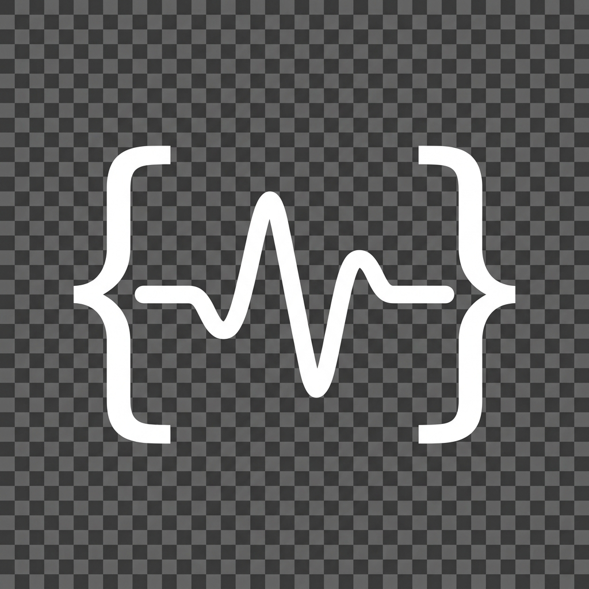

<div align="center">



# Script State

### ⚡ Your AI Coding Companion — Always Watching, Always Ready

[](https://github.com/ForcedScripter/Script-State/releases/latest)
[](https://github.com/ForcedScripter/Script-State/releases/latest)
[](LICENSE)
[](https://github.com/ForcedScripter/Script-State/releases)

**A floating desktop widget that auto-detects your AI prompts from ChatGPT, Gemini, Claude, Cursor, Windsurf, and any AI tool — then shows real-time token counts, quality scores, cost estimates, and context window usage. All in a tiny, draggable box on your screen.**

<br/>

[**📥 Download for Windows (.exe)**](https://github.com/ForcedScripter/Script-State/releases/latest)
&nbsp;&nbsp;·&nbsp;&nbsp;
[Report Bug](https://github.com/ForcedScripter/Script-State/issues)
&nbsp;&nbsp;·&nbsp;&nbsp;
[Request Feature](https://github.com/ForcedScripter/Script-State/issues)

<br/>

</div>

---

## 🎯 What Is Script State?

Script State is a **lightweight floating widget** that sits on your desktop while you vibe-code with AI. It **auto-detects prompts** from your clipboard — whenever you copy text from ChatGPT, Gemini, Claude, Cursor IDE, Windsurf, or any AI-powered tool, Script State instantly analyzes it and shows you:

| Metric | What It Does |
|:--|:--|
| 🔢 **Token Count** | Real-time input/output token estimation |
| 📊 **Quality Score** | Grades your prompt A+ through F with improvement tips |
| 📐 **Context Window** | Shows how much of the model's context you're using |
| 💰 **Cost Estimate** | Per-request cost projection across 10+ models |

> **No API keys needed.** All analysis runs locally on your machine.

---

## ✨ Key Features

### 🧲 Auto-Detection
- **Clipboard monitoring** — copies from any AI chat, IDE, or browser are analyzed instantly
- Works with **ChatGPT**, **Gemini**, **Claude**, **Cursor**, **Windsurf**, **Copilot**, and more
- Green pulse indicator shows when monitoring is active
- Toggle monitoring on/off with one click

### 📊 Real-Time Analysis
- **Token estimation** for 10+ models (GPT-4o, Claude 4 Opus, Gemini 2.5 Pro, etc.)
- **Prompt quality scoring** across 5 dimensions: Length, Specificity, Structure, Clarity, Intent
- **Actionable suggestions** to improve your prompts before sending
- **Cost projection** with input/output cost breakdown

### 🖥️ Dual Interface
- **Widget** — tiny floating box (290×210px), always on top, draggable anywhere
- **Dashboard** — full analysis app with detailed breakdowns, opened from widget or tray
- Widget stays in background even when dashboard is closed

### 🔧 Background Operation
- Runs from **system tray** — persists even when all windows are closed
- **Global hotkey** `Ctrl+Shift+S` to show/hide widget instantly
- Minimal resource usage (~30MB RAM)
- Auto-starts analysis when new clipboard content is detected

### 🎨 Premium Design
- Dark glassmorphism UI with cyan-violet gradient accents
- Frameless, transparent window with rounded corners
- Smooth micro-animations and transitions
- JetBrains Mono for metrics, Inter for text

---

## 🚀 Quick Start

### Download & Install
1. **[Download the latest release](https://github.com/ForcedScripter/Script-State/releases/latest)** (.exe for Windows)
2. Run the installer
3. Script State appears as a floating widget on your screen
4. Start using any AI tool — Script State auto-detects your prompts!

### Usage
1. **Copy any prompt** from ChatGPT, Claude, Cursor, or type one yourself
2. Script State **auto-analyzes** it within 1 second
3. View token count, quality grade, context usage, and cost in the widget
4. Click **"Full Analysis"** to open the detailed dashboard
5. Use `Ctrl+Shift+S` to toggle the widget visibility

---

## 🎛️ Supported Models

| Provider | Models | Max Context |
|:--|:--|:--|
| **OpenAI** | GPT-4o, GPT-4o Mini, GPT-4 Turbo | 128K |
| **Anthropic** | Claude 4 Opus, Claude 4 Sonnet, Claude 3.5 Haiku | 200K |
| **Google** | Gemini 2.5 Pro, Gemini 2.0 Flash | 1M |
| **Meta** | Llama 3.3 70B | 128K |
| **DeepSeek** | DeepSeek V3 | 128K |

---

## 🛠️ Build from Source

```bash
# Clone
git clone https://github.com/ForcedScripter/Script-State.git
cd Script-State

# Install dependencies
npm install

# Run in development
npm run dev

# Build installer
npm run package
```

### Tech Stack
- **Electron 33** — Cross-platform desktop shell
- **React 19** + **TypeScript** — UI framework
- **Vite 6** — Lightning-fast build tool
- **Zustand** — Lightweight state management
- **Lucide** — Beautiful icon set

---

## 🗺️ Roadmap

- [x] Floating widget with auto-detection
- [x] Token counting for 10+ models
- [x] Prompt quality scoring (5 factors)
- [x] Cost estimation
- [x] Context window visualization
- [x] System tray persistence
- [x] Full analysis dashboard
- [ ] Conversation memory & knowledge graph
- [ ] State versioning & rollback
- [ ] Plugin system for custom metrics
- [ ] Direct API integration (live latency tracking)
- [ ] Multi-language prompt analysis

---

## 📸 Screenshots

### Compact Widget
> The floating widget auto-detects prompts from your clipboard and shows key metrics at a glance.

### Full Dashboard
> Click "Full Analysis" to open the detailed dashboard with quality breakdowns, suggestions, and context gauges.

---

## ⌨️ Keyboard Shortcuts

| Shortcut | Action |
|:--|:--|
| `Ctrl+Shift+S` | Toggle widget visibility |
| Double-click tray | Open full dashboard |
| Right-click tray | Access quick menu |

---

## 🤝 Contributing

Contributions are welcome! Feel free to:
1. Fork the repo
2. Create a feature branch (`git checkout -b feature/amazing-feature`)
3. Commit your changes (`git commit -m 'Add amazing feature'`)
4. Push to the branch (`git push origin feature/amazing-feature`)
5. Open a Pull Request

---

## 📄 License

Distributed under the MIT License. See [LICENSE](LICENSE) for more information.

---

<div align="center">

**Built with ❤️ for the vibe-coding community**

[⬆ Back to top](#script-state)

</div>
